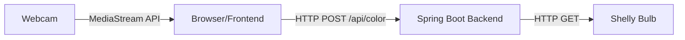

# Design Document

## Overview

The RGBW Bulb Control Application is a simple web application that bridges webcam color detection with smart bulb control. The architecture follows a client-server model where the browser-based frontend handles camera access and color detection, while the Spring Boot backend manages communication with the Shelly bulb.

The design prioritizes simplicity and demo-friendliness: no databases, no complex state management, no authentication, and minimal dependencies.

## Architecture



### Component Overview

1. **Frontend Client** (HTML/JS/CSS)
   - Captures webcam video stream
   - Detects dominant color from video frames
   - Provides UI for manual/auto mode control
   - Sends color data to backend via REST API

2. **Backend Server** (Spring Boot)
   - Exposes REST endpoint for color commands
   - Translates RGB values to Shelly API format
   - Sends HTTP requests to Shelly bulb
   - Serves static frontend files

3. **Shelly Bulb** (External Device)
   - Receives color commands via Gen1 HTTP API
   - Changes RGBW LED color based on commands

## Components and Interfaces

### Backend Components

#### 1. ColorController
**Responsibility**: REST API endpoint for receiving color commands

```java
@RestController
@RequestMapping("/api")
public class ColorController {
    
    private final ShellyBulbService shellyBulbService;
    
    // Constructor injection
    public ColorController(ShellyBulbService shellyBulbService) {
        this.shellyBulbService = shellyBulbService;
    }
    
    @PostMapping("/color")
    public ResponseEntity<ColorResponse> setColor(@RequestBody ColorRequest request) {
        // Delegate to service layer
    }
}
```

**Interface**:
- **Endpoint**: `POST /api/color`
- **Request Body**: `ColorRequest` record with RGB values
- **Response**: `ColorResponse` record with success status
- **Error Handling**: Returns 500 status on bulb communication failure

#### 2. ShellyBulbService
**Responsibility**: Communication with Shelly bulb via HTTP

```java
@Service
public class ShellyBulbService {
    
    private final RestClient restClient;
    private final String bulbBaseUrl;
    
    public ShellyBulbService(@Value("${shelly.bulb.ip}") String bulbIp) {
        this.bulbBaseUrl = "http://" + bulbIp;
        this.restClient = RestClient.create();
    }
    
    public void setColor(int red, int green, int blue) {
        // Build Shelly Gen1 API URL
        // Send GET request
    }
}
```

**Shelly Gen1 API Format**:
- URL Pattern: `http://{bulb-ip}/light/0?turn=on&red={r}&green={g}&blue={b}`
- Method: HTTP GET
- Parameters: red, green, blue (0-255 range)

#### 3. Model Classes

```java
// Request from frontend
public record ColorRequest(int red, int green, int blue) {}

// Response to frontend
public record ColorResponse(boolean success, String message) {}
```

### Frontend Components

#### 1. Camera Management Module
**Responsibility**: Enumerate cameras and manage video stream

**Key Functions**:
- `initializeCameraSelector()`: Populate dropdown with available cameras
- `startCamera(deviceId)`: Start video stream from selected camera
- `handleCameraError()`: Display error and allow reselection

**MediaStream API Usage**:
```javascript
navigator.mediaDevices.getUserMedia({ video: { deviceId: selectedId } })
```

#### 2. Color Detection Module
**Responsibility**: Calculate dominant color from video frames

**Algorithm**:
1. Draw current video frame to hidden canvas element
2. Use `getImageData()` to extract pixel data
3. Sample pixels (e.g., every 10th pixel for performance)
4. Calculate average RGB values across sampled pixels
5. Return dominant color as `{r, g, b}` object

**Key Functions**:
- `detectDominantColor()`: Main detection logic
- `updateColorPreview(color)`: Update UI preview element

#### 3. Mode Control Module
**Responsibility**: Manage manual vs auto mode behavior

**Manual Mode**:
- User clicks "Send Color" button
- Calls `sendColorToBackend(color)` once

**Auto Mode**:
- User toggles "Auto Mode" switch
- Starts interval timer (3000ms)
- Calls `sendColorToBackend(color)` every 3 seconds
- Clears interval when mode deactivated

**Key Functions**:
- `toggleAutoMode()`: Switch between modes
- `sendColorToBackend(color)`: POST to `/api/color`
- `displayError(message)`: Show error messages

#### 4. UI Layout

**Structure**:
```
┌─────────────────────────────────┐
│  Camera Selector [Dropdown]     │
├─────────────────────────────────┤
│                                 │
│     Video Preview (Large)       │
│                                 │
├─────────────────────────────────┤
│  Color Preview [Large Square]   │
├─────────────────────────────────┤
│  [Send Color Button - 50px+]    │
│  [Auto Mode Toggle - 50px+]     │
└─────────────────────────────────┘
```

**CSS Approach**:
- CSS Grid for main layout
- Flexbox for button row
- High contrast colors (dark background, bright buttons)
- Large touch targets (min 50px height)

## Data Models

### Frontend Data Structures

```javascript
// Color object
const color = {
    r: 0-255,  // Red component
    g: 0-255,  // Green component
    b: 0-255   // Blue component
};

// Camera device
const camera = {
    deviceId: string,
    label: string
};
```

### Backend Data Models

```java
// ColorRequest - incoming from frontend
public record ColorRequest(
    int red,    // 0-255
    int green,  // 0-255
    int blue    // 0-255
) {}

// ColorResponse - outgoing to frontend
public record ColorResponse(
    boolean success,
    String message
) {}
```

### Configuration Properties

```properties
# application.properties
shelly.bulb.ip=192.168.1.100
server.port=8080
```

## Error Handling

### Backend Error Scenarios

1. **Bulb Unreachable**
   - Catch `RestClientException` in service layer
   - Return `ColorResponse(false, "Bulb offline")`
   - Log error with SLF4J

2. **Invalid RGB Values**
   - Spring validation on `ColorRequest`
   - Return 400 Bad Request if values out of range

3. **Configuration Missing**
   - Fail fast on startup if `shelly.bulb.ip` not set
   - Clear error message in logs

### Frontend Error Scenarios

1. **Camera Permission Denied**
   - Display message: "Camera access required"
   - Provide retry button

2. **Camera Disconnected**
   - Detect stream end event
   - Show error and re-enable camera selector

3. **Backend Unreachable**
   - Catch fetch errors
   - Display message: "Cannot connect to server"
   - Continue allowing color detection

4. **Bulb Command Failed**
   - Parse error response from backend
   - Display message from `ColorResponse.message`
   - Allow retry in manual mode

## Testing Strategy

### Backend Unit Tests

**ShellyBulbService Tests**:
- Mock `RestClient` to verify correct URL construction
- Test RGB value formatting
- Verify error handling when bulb unreachable

**ColorController Tests**:
- Test request/response mapping
- Verify service method invocation
- Test error response format

### Frontend Integration Tests (Playwright)

**Test Scenarios**:
1. Camera selector populates with devices
2. Video stream displays after camera selection
3. Color preview updates continuously
4. Manual send button triggers color change
5. Auto mode sends color every 3 seconds
6. Error messages display on failures
7. Cross-browser compatibility (Chrome, Firefox, Safari)

**Test Approach**:
- Use Playwright to control browser
- Mock camera with test video file
- Mock backend responses for error scenarios
- Verify actual bulb color change in happy path

### Manual Testing Checklist

- [ ] Run with `mvn spring-boot:run`
- [ ] Verify webcam activates automatically
- [ ] Check color preview updates in real-time
- [ ] Test manual send (bulb changes within 2s)
- [ ] Test auto mode (sends every 3s)
- [ ] Verify UI visibility from 10 meters
- [ ] Test with bulb offline (graceful error)
- [ ] Verify no crashes during 5-minute demo

## Implementation Notes

### File Structure

```
src/
├── main/
│   ├── java/
│   │   └── com/vibecoding/rgbw/
│   │       ├── VibeCodingApplication.java
│   │       ├── controller/
│   │       │   └── ColorController.java
│   │       ├── service/
│   │       │   └── ShellyBulbService.java
│   │       └── model/
│   │           ├── ColorRequest.java
│   │           └── ColorResponse.java
│   └── resources/
│       ├── application.properties
│       └── static/
│           ├── index.html
│           ├── app.js
│           └── styles.css
└── test/
    └── java/
        └── com/vibecoding/rgbw/
            ├── service/
            │   └── ShellyBulbServiceTest.java
            └── controller/
                └── ColorControllerTest.java
```

### Key Design Decisions

1. **Why RestClient over RestTemplate?**
   - RestClient is the modern Spring 6+ approach
   - Simpler API, better for straightforward HTTP calls
   - No need for configuration beans

2. **Why No WebSockets?**
   - Adds complexity without benefit for this use case
   - HTTP polling every 3 seconds is sufficient
   - Easier to debug during demo

3. **Why Vanilla JS over Framework?**
   - No build step required
   - Faster to explain during demo
   - MediaStream API works directly in browser

4. **Why Sample Pixels Instead of Full Frame?**
   - Performance: analyzing every pixel is slow
   - Sampling every 10th pixel gives good approximation
   - Keeps UI responsive

5. **Why Gen1 API over Gen2?**
   - Gen1 uses simple GET requests
   - No JSON-RPC complexity
   - More reliable for demo environment

### Performance Considerations

- **Color Detection**: Sample pixels (not full frame) to maintain 30fps
- **Auto Mode**: 3-second interval prevents network flooding
- **Backend**: Stateless design allows horizontal scaling (if needed)
- **No Caching**: Simplicity over optimization for demo

### Security Considerations

**Intentionally Omitted** (demo context):
- No authentication/authorization
- No HTTPS (local network only)
- No input sanitization beyond basic validation
- No rate limiting

**Production Considerations** (out of scope):
- Would need HTTPS for camera access on public networks
- Would need authentication for bulb control
- Would need CORS configuration for cross-origin requests
